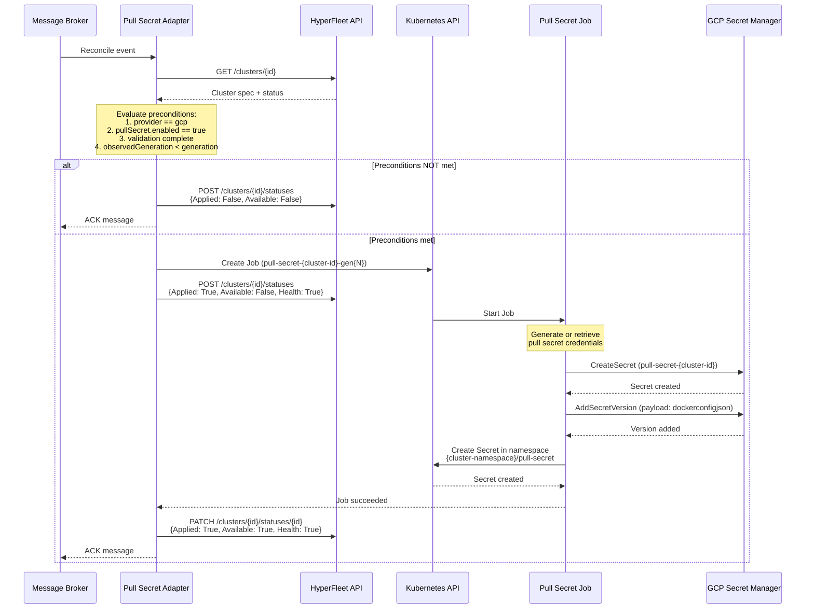

# Pull Secret Adapter - Implementation Specification

**Date**: Nov-04, 2025
**Status**: In-progress
**Cloud Provider**: GCP (MVP)

---

## Executive Summary

The Pull Secret Adapter is responsible for managing container image pull secrets for HyperShift hosted clusters. It:

1. Generates or retrieves pull secrets for container registries (e.g., `quay.io`, `registry.redhat.io`)
2. Stores pull secrets securely in GCP Secret Manager
3. Creates Kubernetes Secrets in the management cluster namespace
4. Handles create, update, and delete operations
5. Reports status back to HyperFleet API using the condition-based contract

**Key Design Principle**: Pull secrets are stored in both GCP Secret Manager (for persistence and audit) and Kubernetes Secrets (for HyperShift consumption).

---

## Adapter Criteria

### Preconditions

The Pull Secret Adapter evaluates the following preconditions before executing:

#### 1. Provider Check
```yaml
expression: "cluster.spec.provider == 'gcp'"
```
**Reason**: MVP scope is GCP-only. Adapter should not execute for other providers.

#### 2. Pull Secret Enabled
```yaml
expression: "cluster.spec.pullSecret.enabled == true"
```
**Reason**: Some clusters may not require pull secrets (e.g., public registries only). Only execute if explicitly enabled.

#### 3. ObservedGeneration Check
```yaml
expression: "adapterStatus.observedGeneration < cluster.generation"
```
**Reason**: Ensures adapter processes the latest cluster spec. If adapter has already reconciled the current generation and is successful, skip execution.

**Note**: This check is implicit in the adapter framework. Adapters always check if they've already successfully processed the current generation before creating jobs.

#### 4. Dependency Check - Validation Complete
```yaml
expression: "cluster.status.adapters['validation'].available == 'True' AND cluster.status.adapters['validation'].observedGeneration == cluster.generation"
```
**Reason**: Validation adapter must complete successfully before pull secrets can be created (ensures cluster spec is valid and GCP project exists).

### Precondition Evaluation Logic

```
IF cluster.spec.provider != "gcp":
  SKIP (report status: Applied=False, reason="ProviderNotSupported")

IF cluster.spec.pullSecret.enabled != true:
  SKIP (report status: Applied=False, reason="PullSecretDisabled")

IF validation adapter not Available or observedGeneration < cluster.generation:
  SKIP (report status: Applied=False, reason="PreconditionsNotMet", message="Waiting for validation adapter")

IF adapterStatus.observedGeneration >= cluster.generation AND adapterStatus.available == "True":
  SKIP (report status: already complete for this generation)

# All preconditions met - proceed to create Job
CREATE Job
```

---

## Adapter Workflow

### High-Level Flow



### Detailed Steps

#### 1. Event Consumption
- Adapter consumes CloudEvent from broker subscription `pullsecret-adapter-sub`
- Event contains `resourceId` (cluster ID)

#### 2. Fetch Cluster Details
```http
GET /v1/clusters/{clusterId}
```

Response includes:
- `cluster.spec.provider` - Must be "gcp"
- `cluster.spec.pullSecret.enabled` - Must be true
- `cluster.spec.pullSecret.registries[]` - List of registries (e.g., `["quay.io", "registry.redhat.io"]`)
- `cluster.spec.pullSecret.secretRef` - Optional reference to existing secret
- `cluster.spec.gcpProjectId` - GCP project ID for Secret Manager
- `cluster.spec.namespace` - Kubernetes namespace for the cluster
- `cluster.status.adapters[]` - Array of adapter statuses
- `cluster.generation` - Current cluster generation

#### 3. Evaluate Preconditions
See "Precondition Evaluation Logic" above.

#### 4. Create Kubernetes Job
If preconditions are met, create Job:

```yaml
apiVersion: batch/v1
kind: Job
metadata:
  name: pull-secret-{cluster-id}-gen{generation}
  namespace: hyperfleet-jobs
  labels:
    adapter: pull-secret
    cluster-id: {cluster-id}
    generation: {generation}
spec:
  backoffLimit: 3
  template:
    spec:
      serviceAccountName: pull-secret-job
      restartPolicy: Never
      containers:
      - name: pull-secret-job
        image: quay.io/hyperfleet/pull-secret-job:v1.0.0
        env:
        - name: CLUSTER_ID
          value: "{cluster-id}"
        - name: CLUSTER_GENERATION
          value: "{generation}"
        - name: HYPERFLEET_API
          value: "http://hyperfleet-api:8080"
        - name: GCP_PROJECT_ID
          value: "{cluster.spec.gcpProjectId}"
        - name: CLUSTER_NAMESPACE
          value: "{cluster.spec.namespace}"
        - name: REGISTRIES
          value: "{comma-separated list of registries}"
        - name: GOOGLE_APPLICATION_CREDENTIALS
          value: "/var/secrets/google/key.json"
        volumeMounts:
        - name: gcp-credentials
          mountPath: /var/secrets/google
          readOnly: true
      volumes:
      - name: gcp-credentials
        secret:
          secretName: gcp-secret-manager-credentials
```

#### 5. Job Execution

The Job performs the following operations:

##### 5.1. Generate or Retrieve Pull Secret

**Option A: Generate New Pull Secret**
- If `cluster.spec.pullSecret.secretRef` is empty, generate new credentials
- For GCP, use GCP service account key for Artifact Registry / Container Registry
- For Red Hat registries, use provided credentials from HyperFleet configuration

**Option B: Retrieve Existing Pull Secret**
- If `cluster.spec.pullSecret.secretRef` is provided, retrieve from Kubernetes
- Format: `{namespace}/{secret-name}`

**Pull Secret Format** (Docker config JSON):
```json
{
  "auths": {
    "quay.io": {
      "username": "{username}",
      "password": "{password}",
      "email": "{email}",
      "auth": "{base64(username:password)}"
    },
    "registry.redhat.io": {
      "username": "{username}",
      "password": "{password}",
      "email": "{email}",
      "auth": "{base64(username:password)}"
    },
    "gcr.io": {
      "username": "_json_key",
      "password": "{service-account-json}",
      "email": "not@val.id",
      "auth": "{base64(_json_key:service-account-json)}"
    }
  }
}
```

##### 5.2. Store in GCP Secret Manager

```go
import (
    secretmanager "cloud.google.com/go/secretmanager/apiv1"
    "cloud.google.com/go/secretmanager/apiv1/secretmanagerpb"
)

ctx := context.Background()
client, err := secretmanager.NewClient(ctx)
if err != nil {
    return fmt.Errorf("failed to create secret manager client: %w", err)
}
defer client.Close()

// Step 1: Create secret (idempotent - check if exists first)
secretName := fmt.Sprintf("hyperfleet-pull-secret-%s", clusterID)
parent := fmt.Sprintf("projects/%s", gcpProjectID)

createReq := &secretmanagerpb.CreateSecretRequest{
    Parent:   parent,
    SecretId: secretName,
    Secret: &secretmanagerpb.Secret{
        Replication: &secretmanagerpb.Replication{
            Replication: &secretmanagerpb.Replication_Automatic_{
                Automatic: &secretmanagerpb.Replication_Automatic{},
            },
        },
        Labels: map[string]string{
            "cluster-id": clusterID,
            "managed-by": "hyperfleet",
            "adapter": "pull-secret",
        },
    },
}

secret, err := client.CreateSecret(ctx, createReq)
if err != nil {
    // Check if secret already exists (idempotency)
    if !isAlreadyExistsError(err) {
        return fmt.Errorf("failed to create secret: %w", err)
    }
    // Secret exists, get it
    getReq := &secretmanagerpb.GetSecretRequest{
        Name: fmt.Sprintf("%s/secrets/%s", parent, secretName),
    }
    secret, err = client.GetSecret(ctx, getReq)
    if err != nil {
        return fmt.Errorf("failed to get existing secret: %w", err)
    }
}

// Step 2: Add secret version with pull secret payload
payload := []byte(dockerConfigJSON) // The .dockerconfigjson content

addVersionReq := &secretmanagerpb.AddSecretVersionRequest{
    Parent: secret.Name,
    Payload: &secretmanagerpb.SecretPayload{
        Data: payload,
    },
}

version, err := client.AddSecretVersion(ctx, addVersionReq)
if err != nil {
    return fmt.Errorf("failed to add secret version: %w", err)
}

log.Printf("Created secret version: %s", version.Name)
```

**Error Handling**:
- If secret creation fails due to permissions → Report `Health: False`, reason: `PermissionDenied`
- If secret already exists → Idempotent behavior, add new version
- If project not found → Report `Health: False`, reason: `ProjectNotFound`
- If quota exceeded → Report `Health: False`, reason: `QuotaExceeded`

##### 5.3. Create Kubernetes Secret in Management Cluster

The pull secret must be created in the cluster's namespace on the management cluster so HyperShift can access it.

```go
import (
    corev1 "k8s.io/api/core/v1"
    metav1 "k8s.io/apimachinery/pkg/apis/meta/v1"
    "k8s.io/client-go/kubernetes"
)

// Create Kubernetes client
clientset, err := kubernetes.NewForConfig(config)
if err != nil {
    return fmt.Errorf("failed to create kubernetes client: %w", err)
}

// Create Secret
secret := &corev1.Secret{
    ObjectMeta: metav1.ObjectMeta{
        Name:      "pull-secret",
        Namespace: clusterNamespace, // e.g., "clusters-{cluster-id}"
        Labels: map[string]string{
            "cluster-id": clusterID,
            "managed-by": "hyperfleet",
            "adapter": "pull-secret",
        },
        Annotations: map[string]string{
            "hyperfleet.redhat.com/cluster-id": clusterID,
            "hyperfleet.redhat.com/generation": fmt.Sprintf("%d", generation),
            "hyperfleet.redhat.com/gcp-secret-name": fmt.Sprintf("hyperfleet-pull-secret-%s", clusterID),
        },
    },
    Type: corev1.SecretTypeDockerConfigJson,
    Data: map[string][]byte{
        ".dockerconfigjson": []byte(dockerConfigJSON),
    },
}

// Create or update secret (idempotent)
_, err = clientset.CoreV1().Secrets(clusterNamespace).Create(ctx, secret, metav1.CreateOptions{})
if err != nil {
    if errors.IsAlreadyExists(err) {
        // Secret exists, update it
        _, err = clientset.CoreV1().Secrets(clusterNamespace).Update(ctx, secret, metav1.UpdateOptions{})
        if err != nil {
            return fmt.Errorf("failed to update kubernetes secret: %w", err)
        }
    } else {
        return fmt.Errorf("failed to create kubernetes secret: %w", err)
    }
}

log.Printf("Created/Updated Kubernetes Secret: %s/%s", clusterNamespace, "pull-secret")
```

**Error Handling**:
- If namespace doesn't exist → Report `Health: False`, reason: `NamespaceNotFound`
- If RBAC permissions insufficient → Report `Health: False`, reason: `PermissionDenied`
- If quota exceeded → Report `Health: False`, reason: `ResourceQuotaExceeded`

##### 5.4. Verify Secret Accessibility

Before reporting success, verify the secret can be read:

```go
// Verify Secret Manager secret
accessReq := &secretmanagerpb.AccessSecretVersionRequest{
    Name: fmt.Sprintf("%s/versions/latest", secret.Name),
}
_, err = client.AccessSecretVersion(ctx, accessReq)
if err != nil {
    return fmt.Errorf("failed to verify secret accessibility: %w", err)
}

// Verify Kubernetes secret
_, err = clientset.CoreV1().Secrets(clusterNamespace).Get(ctx, "pull-secret", metav1.GetOptions{})
if err != nil {
    return fmt.Errorf("failed to verify kubernetes secret: %w", err)
}

log.Printf("Verification successful")
```

#### 6. Report Status

The adapter monitors the Job and reports status to the HyperFleet API.

**Status Transitions**:

##### 6.1. Job Created
```http
POST /v1/clusters/{clusterId}/statuses
```

```json
{
  "adapterStatuses": [
    {
      "adapter": "pull-secret",
      "observedGeneration": 1,
      "conditions": [
        {
          "type": "Available",
          "status": "False",
          "reason": "JobRunning",
          "message": "Pull secret job is executing",
          "lastTransitionTime": "2025-10-31T12:00:00Z"
        },
        {
          "type": "Applied",
          "status": "True",
          "reason": "JobLaunched",
          "message": "Kubernetes Job 'pull-secret-cls-123-gen1' created successfully",
          "lastTransitionTime": "2025-10-31T12:00:00Z"
        },
        {
          "type": "Health",
          "status": "True",
          "reason": "NoErrors",
          "message": "Adapter is healthy",
          "lastTransitionTime": "2025-10-31T12:00:00Z"
        }
      ],
      "metadata": {
        "jobName": "pull-secret-cls-123-gen1",
        "jobNamespace": "hyperfleet-jobs"
      },
      "lastUpdated": "2025-10-31T12:00:00Z"
    }
  ]
}
```

##### 6.2. Job Succeeded
```http
PATCH /v1/clusters/{clusterId}/statuses/{statusId}
```

```json
{
  "adapter": "pull-secret",
  "observedGeneration": 1,
  "conditions": [
    {
      "type": "Available",
      "status": "True",
      "reason": "SecretsCreated",
      "message": "Pull secret stored in GCP Secret Manager and Kubernetes Secret created successfully",
      "lastTransitionTime": "2025-10-31T12:02:30Z"
    },
    {
      "type": "Applied",
      "status": "True",
      "reason": "JobLaunched",
      "message": "Kubernetes Job created successfully",
      "lastTransitionTime": "2025-10-31T12:00:00Z"
    },
    {
      "type": "Health",
      "status": "True",
      "reason": "AllChecksPass",
      "message": "Pull secret verified in both GCP Secret Manager and Kubernetes",
      "lastTransitionTime": "2025-10-31T12:02:30Z"
    }
  ],
  "data": {
    "gcpSecretName": "hyperfleet-pull-secret-cls-123",
    "gcpSecretVersion": "projects/my-project/secrets/hyperfleet-pull-secret-cls-123/versions/1",
    "kubernetesSecretName": "pull-secret",
    "kubernetesSecretNamespace": "clusters-cls-123",
    "registries": ["quay.io", "registry.redhat.io", "gcr.io"],
    "executionTime": "150s"
  },
  "metadata": {
    "jobName": "pull-secret-cls-123-gen1",
    "completedAt": "2025-10-31T12:02:30Z"
  },
  "lastUpdated": "2025-10-31T12:02:30Z"
}
```

##### 6.3. Job Failed (Example: Permission Denied)
```http
PATCH /v1/clusters/{clusterId}/statuses/{statusId}
```

```json
{
  "adapter": "pull-secret",
  "observedGeneration": 1,
  "conditions": [
    {
      "type": "Available",
      "status": "False",
      "reason": "SecretCreationFailed",
      "message": "Failed to create secret in GCP Secret Manager",
      "lastTransitionTime": "2025-10-31T12:01:00Z"
    },
    {
      "type": "Applied",
      "status": "True",
      "reason": "JobLaunched",
      "message": "Kubernetes Job created successfully",
      "lastTransitionTime": "2025-10-31T12:00:00Z"
    },
    {
      "type": "Health",
      "status": "False",
      "reason": "PermissionDenied",
      "message": "Service account lacks 'secretmanager.secrets.create' permission in project 'my-project'",
      "lastTransitionTime": "2025-10-31T12:01:00Z"
    }
  ],
  "data": {
    "error": {
      "type": "PermissionDenied",
      "message": "rpc error: code = PermissionDenied desc = Permission denied",
      "project": "my-project"
    }
  },
  "lastUpdated": "2025-10-31T12:01:00Z"
}
```

##### 6.4. Preconditions Not Met
```http
POST /v1/clusters/{clusterId}/statuses
```

```json
{
  "adapterStatuses": [
    {
      "adapter": "pull-secret",
      "observedGeneration": 1,
      "conditions": [
        {
          "type": "Available",
          "status": "False",
          "reason": "PreconditionsNotMet",
          "message": "Waiting for validation adapter to complete",
          "lastTransitionTime": "2025-10-31T12:00:00Z"
        },
        {
          "type": "Applied",
          "status": "False",
          "reason": "PreconditionsNotMet",
          "message": "Validation adapter has not completed",
          "lastTransitionTime": "2025-10-31T12:00:00Z"
        },
        {
          "type": "Health",
          "status": "True",
          "reason": "NoErrors",
          "message": "Adapter is healthy, waiting for dependencies",
          "lastTransitionTime": "2025-10-31T12:00:00Z"
        }
      ],
      "lastUpdated": "2025-10-31T12:00:00Z"
    }
  ]
}
```

---

## Delete Operations

When a cluster is deleted, the Pull Secret Adapter must clean up resources.

### Delete Workflow

1. **Receive Delete Event**
   - Sentinel publishes event with `eventType: "delete"`

2. **Fetch Cluster Details**
   - GET cluster to retrieve GCP project ID, namespace, cluster ID

3. **Delete GCP Secret Manager Secret**
```go
deleteReq := &secretmanagerpb.DeleteSecretRequest{
    Name: fmt.Sprintf("projects/%s/secrets/hyperfleet-pull-secret-%s", gcpProjectID, clusterID),
}
err := client.DeleteSecret(ctx, deleteReq)
// Idempotent - ignore NotFound errors
```

4. **Delete Kubernetes Secret**
```go
err := clientset.CoreV1().Secrets(clusterNamespace).Delete(ctx, "pull-secret", metav1.DeleteOptions{})
// Idempotent - ignore NotFound errors
```

5. **Report Status**
```json
{
  "adapter": "pull-secret",
  "observedGeneration": 1,
  "conditions": [
    {
      "type": "Available",
      "status": "True",
      "reason": "ResourcesDeleted",
      "message": "Pull secrets deleted from GCP Secret Manager and Kubernetes",
      "lastTransitionTime": "2025-10-31T12:05:00Z"
    },
    {
      "type": "Applied",
      "status": "True",
      "reason": "DeleteCompleted",
      "message": "Delete operation completed successfully",
      "lastTransitionTime": "2025-10-31T12:05:00Z"
    },
    {
      "type": "Health",
      "status": "True",
      "reason": "NoErrors",
      "message": "Delete operation completed without errors",
      "lastTransitionTime": "2025-10-31T12:05:00Z"
    }
  ]
}
```

---

## Update Operations

When a cluster spec changes (e.g., new registry added), the adapter must update secrets.

### Update Workflow

1. **Detect Generation Change**
   - `adapterStatus.observedGeneration < cluster.generation`

2. **Regenerate Pull Secret**
   - Include new registries from `cluster.spec.pullSecret.registries[]`

3. **Update GCP Secret Manager**
   - Add new secret version (automatically marks previous version as superseded)

4. **Update Kubernetes Secret**
   - Update secret with new `.dockerconfigjson`

5. **Report Status**
   - Update `observedGeneration` to current `cluster.generation`

---

## Configuration

### AdapterConfig CRD

```yaml
apiVersion: hyperfleet.redhat.com/v1alpha1
kind: AdapterConfig
metadata:
  name: pull-secret-adapter
  namespace: hyperfleet-system
spec:
  adapterType: pull-secret

  # Precondition criteria
  criteria:
    preconditions:
      - expression: "cluster.spec.provider == 'gcp'"
      - expression: "cluster.spec.pullSecret.enabled == true"
    dependencies:
      - adapter: validation
        condition: Available
        status: "True"

  # HyperFleet API configuration
  hyperfleetAPI:
    url: http://hyperfleet-api:8080
    timeout: 10s

  # Message broker configuration
  broker:
    type: gcp-pubsub
    subscription: pullsecret-adapter-sub

  # Job template configuration
  jobTemplate:
    image: quay.io/hyperfleet/pull-secret-job:v1.0.0
    ttlSecondsAfterFinished: 3600 # Clean up jobs after 1 hour
    activeDeadlineSeconds: 600    # Job timeout: 10 minutes
    resources:
      requests:
        cpu: 100m
        memory: 128Mi
      limits:
        cpu: 500m
        memory: 512Mi
```

### Cluster Spec Example

```yaml
apiVersion: hyperfleet.redhat.com/v1alpha1
kind: Cluster
metadata:
  name: my-cluster
spec:
  provider: gcp
  gcpProjectId: my-gcp-project
  namespace: clusters-cls-123

  pullSecret:
    enabled: true
    registries:
      - quay.io
      - registry.redhat.io
      - gcr.io
    # Optional: reference existing secret instead of generating
    # secretRef: hyperfleet-system/global-pull-secret
```

---

## RBAC Requirements

### Adapter Service Account (Kubernetes)

The adapter deployment needs permissions to:
- Create/Read/Update Jobs in `hyperfleet-jobs` namespace
- Read AdapterConfig CRD

```yaml
apiVersion: v1
kind: ServiceAccount
metadata:
  name: pull-secret-adapter
  namespace: hyperfleet-system
---
apiVersion: rbac.authorization.k8s.io/v1
kind: Role
metadata:
  name: pull-secret-adapter
  namespace: hyperfleet-jobs
rules:
- apiGroups: ["batch"]
  resources: ["jobs"]
  verbs: ["create", "get", "list", "watch", "delete"]
- apiGroups: [""]
  resources: ["pods"]
  verbs: ["get", "list", "watch"]
- apiGroups: [""]
  resources: ["pods/log"]
  verbs: ["get"]
---
apiVersion: rbac.authorization.k8s.io/v1
kind: Role
metadata:
  name: pull-secret-adapter-config
  namespace: hyperfleet-system
rules:
- apiGroups: ["hyperfleet.redhat.com"]
  resources: ["adapterconfigs"]
  verbs: ["get", "list", "watch"]
```

### Job Service Account (Kubernetes)

The Job needs permissions to:
- Create/Read/Update Secrets in cluster namespaces

```yaml
apiVersion: v1
kind: ServiceAccount
metadata:
  name: pull-secret-job
  namespace: hyperfleet-jobs
---
apiVersion: rbac.authorization.k8s.io/v1
kind: ClusterRole
metadata:
  name: pull-secret-job
rules:
- apiGroups: [""]
  resources: ["secrets"]
  verbs: ["create", "get", "update", "delete"]
- apiGroups: [""]
  resources: ["namespaces"]
  verbs: ["get", "list"]
---
apiVersion: rbac.authorization.k8s.io/v1
kind: ClusterRoleBinding
metadata:
  name: pull-secret-job
roleRef:
  apiGroup: rbac.authorization.k8s.io
  kind: ClusterRole
  name: pull-secret-job
subjects:
- kind: ServiceAccount
  name: pull-secret-job
  namespace: hyperfleet-jobs
```

### GCP Service Account (IAM)

The Job needs GCP permissions to:
- Create secrets in Secret Manager
- Add secret versions
- Access (read) secret versions
- Delete secrets

**Required IAM Roles**:
- `roles/secretmanager.admin` (for create/delete/update)

Or create custom role with minimum permissions:
```yaml
title: "HyperFleet Pull Secret Manager"
permissions:
- secretmanager.secrets.create
- secretmanager.secrets.delete
- secretmanager.secrets.get
- secretmanager.versions.add
- secretmanager.versions.access
```

**Bind to Service Account**:
```bash
gcloud projects add-iam-policy-binding my-gcp-project \
  --member="serviceAccount:hyperfleet-pull-secret@my-gcp-project.iam.gserviceaccount.com" \
  --role="roles/secretmanager.admin"
```

**Create Service Account Key**:
```bash
gcloud iam service-accounts keys create key.json \
  --iam-account=hyperfleet-pull-secret@my-gcp-project.iam.gserviceaccount.com

kubectl create secret generic gcp-secret-manager-credentials \
  --from-file=key.json=key.json \
  --namespace=hyperfleet-jobs
```

---

## Observability

### Metrics

The adapter exposes the following Prometheus metrics:

| Metric Name | Type | Labels | Description |
|-------------|------|--------|-------------|
| `hyperfleet_pullsecret_events_consumed_total` | Counter | `cluster_id` | Total events consumed |
| `hyperfleet_pullsecret_jobs_created_total` | Counter | `cluster_id`, `result` | Total jobs created |
| `hyperfleet_pullsecret_job_duration_seconds` | Histogram | `cluster_id`, `result` | Job execution time |
| `hyperfleet_pullsecret_gcp_secret_operations_total` | Counter | `operation`, `result` | GCP Secret Manager operations |
| `hyperfleet_pullsecret_k8s_secret_operations_total` | Counter | `operation`, `result` | Kubernetes Secret operations |
| `hyperfleet_pullsecret_precondition_failures_total` | Counter | `reason` | Precondition evaluation failures |

**Label Values**:
- `operation`: `create`, `update`, `delete`, `get`
- `result`: `success`, `failure`
- `reason`: `ProviderNotSupported`, `PullSecretDisabled`, `PreconditionsNotMet`, `AlreadyComplete`

### Logging

The adapter uses structured logging with the following fields:

```json
{
  "timestamp": "2025-10-31T12:00:00Z",
  "level": "info",
  "adapter": "pull-secret",
  "cluster_id": "cls-123",
  "generation": 1,
  "message": "Pull secret job completed successfully",
  "job_name": "pull-secret-cls-123-gen1",
  "execution_time": "150s",
  "gcp_secret_name": "hyperfleet-pull-secret-cls-123",
  "k8s_secret_namespace": "clusters-cls-123",
  "registries": ["quay.io", "registry.redhat.io"]
}
```

**Log Levels**:
- `debug`: Precondition evaluation details, secret content (redacted)
- `info`: Job creation, status updates, successful operations
- `warn`: Preconditions not met, retryable errors
- `error`: Job failures, permission errors, unexpected errors

---

## Testing Strategy

### Unit Tests

1. **Precondition Evaluation**
   - Test all precondition combinations
   - Verify skip logic for unsupported providers
   - Verify dependency checks

2. **Status Reporting**
   - Test condition construction
   - Verify all three required conditions present
   - Test aggregation logic

3. **Configuration Parsing**
   - Test AdapterConfig CRD parsing
   - Verify default values

### Integration Tests

1. **Job Creation**
   - Verify job template rendering
   - Test job creation with various cluster specs
   - Verify RBAC permissions

2. **GCP Secret Manager Integration**
   - Test secret creation (with emulator)
   - Test version addition
   - Test idempotency
   - Test error handling

3. **Kubernetes Secret Integration**
   - Test secret creation
   - Test secret updates
   - Test namespace isolation

### E2E Tests

1. **Full Workflow**
   - Create cluster with pullSecret enabled
   - Verify adapter creates job
   - Verify secrets created in both GCP and Kubernetes
   - Verify status reported correctly

2. **Update Workflow**
   - Update cluster spec (add registry)
   - Verify new generation triggers reconciliation
   - Verify secrets updated

3. **Delete Workflow**
   - Delete cluster
   - Verify secrets removed from both GCP and Kubernetes

---

## Implementation Tasks

Below is the detailed task breakdown for implementing the Pull Secret Adapter.

### Phase 1: Adapter Framework Setup (Week 1)

#### Task 1.1: Create Adapter Service Skeleton
**Estimated Time**: 2 days
**Description**: Set up the adapter service structure following the HyperFleet adapter pattern.

**Deliverables**:
- [ ] Create Go module: `github.com/redhat/hyperfleet/adapters/pull-secret`
- [ ] Implement broker subscriber (GCP Pub/Sub and RabbitMQ support)
- [ ] Implement CloudEvent consumer
- [ ] Implement HyperFleet API client for GET /clusters and POST/PATCH /statuses
- [ ] Implement precondition evaluation framework
- [ ] Implement Job creation framework
- [ ] Implement Job monitoring (watch Job status)
- [ ] Set up logging with structured fields
- [ ] Set up Prometheus metrics

**Acceptance Criteria**:
- Adapter can consume events from broker
- Adapter can fetch cluster details from API
- Adapter can create Jobs
- Adapter can monitor Job status
- Unit tests pass (>80% coverage)

#### Task 1.2: Implement Precondition Logic
**Estimated Time**: 1 day
**Description**: Implement all precondition checks according to the specification.

**Deliverables**:
- [ ] Implement `cluster.spec.provider == 'gcp'` check
- [ ] Implement `cluster.spec.pullSecret.enabled == true` check
- [ ] Implement observedGeneration check
- [ ] Implement validation adapter dependency check
- [ ] Implement skip logic with appropriate status reporting
- [ ] Add precondition metrics

**Acceptance Criteria**:
- All precondition checks working correctly
- Skip logic reports correct status
- Precondition failures increment metrics
- Unit tests for all precondition combinations

#### Task 1.3: Implement Status Reporting
**Estimated Time**: 1 day
**Description**: Implement the status reporting contract with all three required conditions.

**Deliverables**:
- [ ] Implement POST /statuses (create ClusterStatus)
- [ ] Implement PATCH /statuses/{id} (update adapter status)
- [ ] Implement upsert pattern (GET → POST or PATCH)
- [ ] Implement condition construction (Available, Applied, Health)
- [ ] Implement data field population
- [ ] Implement metadata field population

**Acceptance Criteria**:
- Status reports include all three conditions
- Upsert pattern works correctly
- Data field includes relevant information
- Unit tests for status construction

#### Task 1.4: Create AdapterConfig CRD
**Estimated Time**: 1 day
**Description**: Define and install the AdapterConfig CRD for Pull Secret Adapter.

**Deliverables**:
- [ ] Create CRD YAML definition
- [ ] Install CRD in cluster
- [ ] Create example AdapterConfig instance
- [ ] Implement CRD loading in adapter
- [ ] Implement configuration validation

**Acceptance Criteria**:
- CRD can be created and updated
- Adapter reads configuration from CRD
- Configuration changes trigger adapter reload
- Validation prevents invalid configurations

### Phase 2: Pull Secret Job Implementation (Week 2)

#### Task 2.1: Implement Pull Secret Generation
**Estimated Time**: 2 days
**Description**: Implement logic to generate or retrieve pull secrets.

**Deliverables**:
- [ ] Implement Docker config JSON generation
- [ ] Support multiple registries (quay.io, registry.redhat.io, gcr.io)
- [ ] Implement username/password authentication format
- [ ] Implement `_json_key` format for GCP
- [ ] Implement base64 encoding for auth field
- [ ] Support reading from existing secret (secretRef)
- [ ] Add validation for pull secret format

**Acceptance Criteria**:
- Generated pull secrets are valid Docker config JSON
- Multiple registries supported
- Existing secrets can be retrieved and used
- Unit tests for all registry types

#### Task 2.2: Implement GCP Secret Manager Integration
**Estimated Time**: 3 days
**Description**: Implement GCP Secret Manager operations for storing pull secrets.

**Deliverables**:
- [ ] Import GCP Secret Manager SDK
- [ ] Implement authentication via service account
- [ ] Implement CreateSecret operation (with idempotency)
- [ ] Implement AddSecretVersion operation
- [ ] Implement GetSecret operation (for idempotency check)
- [ ] Implement DeleteSecret operation (for cleanup)
- [ ] Implement AccessSecretVersion operation (for verification)
- [ ] Add proper error handling for all GCP errors
- [ ] Add retry logic with exponential backoff
- [ ] Add metrics for GCP operations

**Acceptance Criteria**:
- Secrets created successfully in GCP Secret Manager
- Idempotent behavior (can run multiple times)
- Error handling for permissions, quota, not found
- Integration tests with GCP Secret Manager emulator
- Metrics tracked for all operations

#### Task 2.3: Implement Kubernetes Secret Creation
**Estimated Time**: 2 days
**Description**: Implement Kubernetes Secret operations in the management cluster.

**Deliverables**:
- [ ] Import Kubernetes client-go SDK
- [ ] Implement authentication via in-cluster config
- [ ] Implement CreateSecret operation (type: dockerconfigjson)
- [ ] Implement UpdateSecret operation
- [ ] Implement GetSecret operation (for idempotency check)
- [ ] Implement DeleteSecret operation (for cleanup)
- [ ] Add proper labels and annotations
- [ ] Add proper error handling
- [ ] Add metrics for Kubernetes operations

**Acceptance Criteria**:
- Secrets created successfully in Kubernetes
- Type is `kubernetes.io/dockerconfigjson`
- Idempotent behavior
- Error handling for namespace not found, permissions, quota
- Integration tests with test cluster

### Phase 3: Job Execution and Monitoring (Week 2-3)

#### Task 3.1: Create Job Container Image
**Estimated Time**: 2 days
**Description**: Create the container image that executes the pull secret job.

**Deliverables**:
- [ ] Create Dockerfile
- [ ] Implement main.go for job execution
- [ ] Parse environment variables (CLUSTER_ID, GCP_PROJECT_ID, etc.)
- [ ] Implement pull secret generation logic
- [ ] Implement GCP Secret Manager operations
- [ ] Implement Kubernetes Secret operations
- [ ] Implement verification logic
- [ ] Add comprehensive error handling
- [ ] Add structured logging
- [ ] Build and push to quay.io

**Acceptance Criteria**:
- Container image builds successfully
- Image pushed to quay.io
- Job runs successfully in test cluster
- Logs are structured and informative

#### Task 3.2: Implement Job Monitoring
**Estimated Time**: 2 days
**Description**: Implement Job status monitoring in the adapter.

**Deliverables**:
- [ ] Implement Job watcher (Kubernetes informer)
- [ ] Detect Job completion (success/failure)
- [ ] Parse Job logs for error details
- [ ] Update adapter status based on Job status
- [ ] Implement timeout handling (activeDeadlineSeconds)
- [ ] Implement retry handling (backoffLimit)
- [ ] Clean up completed Jobs (TTL)

**Acceptance Criteria**:
- Adapter detects Job completion
- Status updated correctly based on Job status
- Job logs included in status message on failure
- Timeouts and retries handled correctly

### Phase 4: Delete and Update Operations (Week 3)

#### Task 4.1: Implement Delete Operations
**Estimated Time**: 2 days
**Description**: Implement cleanup logic when clusters are deleted.

**Deliverables**:
- [ ] Detect delete events from broker
- [ ] Implement GCP Secret Manager secret deletion
- [ ] Implement Kubernetes Secret deletion
- [ ] Add idempotent behavior (ignore NotFound errors)
- [ ] Report delete completion status
- [ ] Add metrics for delete operations

**Acceptance Criteria**:
- Secrets deleted from both GCP and Kubernetes
- Idempotent (can run multiple times)
- Status reported correctly
- Integration tests pass

#### Task 4.2: Implement Update Operations
**Estimated Time**: 2 days
**Description**: Implement update logic when cluster specs change.

**Deliverables**:
- [ ] Detect generation changes
- [ ] Regenerate pull secret with updated registries
- [ ] Add new version to GCP Secret Manager
- [ ] Update Kubernetes Secret
- [ ] Update observedGeneration in status
- [ ] Add metrics for update operations

**Acceptance Criteria**:
- Updates triggered on generation change
- New secret versions created
- Kubernetes Secret updated
- observedGeneration matches cluster.generation

### Phase 5: Testing and Documentation (Week 4)

#### Task 5.1: Unit Tests
**Estimated Time**: 2 days
**Description**: Comprehensive unit tests for all components.

**Deliverables**:
- [ ] Precondition evaluation tests
- [ ] Status reporting tests
- [ ] Pull secret generation tests
- [ ] Job template rendering tests
- [ ] Configuration parsing tests
- [ ] Achieve >80% code coverage

**Acceptance Criteria**:
- All unit tests pass
- Code coverage >80%
- Tests cover edge cases and error conditions

#### Task 5.2: Integration Tests
**Estimated Time**: 2 days
**Description**: Integration tests with real dependencies.

**Deliverables**:
- [ ] GCP Secret Manager integration tests (with emulator)
- [ ] Kubernetes Secret integration tests (with test cluster)
- [ ] Broker integration tests (with test broker)
- [ ] HyperFleet API integration tests (with mock API)

**Acceptance Criteria**:
- All integration tests pass
- Tests run in CI pipeline
- Tests verify full workflow

#### Task 5.3: E2E Tests
**Estimated Time**: 2 days
**Description**: End-to-end tests in test environment.

**Deliverables**:
- [ ] Full cluster creation workflow test
- [ ] Update workflow test
- [ ] Delete workflow test
- [ ] Failure scenario tests (permissions, quota, etc.)

**Acceptance Criteria**:
- All E2E tests pass
- Tests verify complete adapter behavior
- Failure scenarios handled correctly

#### Task 5.4: Documentation
**Estimated Time**: 1 day
**Description**: Complete adapter documentation.

**Deliverables**:
- [ ] README.md with overview and usage
- [ ] Architecture diagram
- [ ] Configuration examples
- [ ] Troubleshooting guide
- [ ] RBAC setup guide
- [ ] API reference (godoc)

**Acceptance Criteria**:
- Documentation complete and accurate
- Examples work as documented
- Troubleshooting guide covers common issues

### Phase 6: Deployment and Observability (Week 4)

#### Task 6.1: Create Deployment Manifests
**Estimated Time**: 1 day
**Description**: Create Kubernetes deployment manifests.

**Deliverables**:
- [ ] Deployment YAML
- [ ] ServiceAccount YAML
- [ ] RBAC Role/RoleBinding YAML
- [ ] AdapterConfig YAML
- [ ] Secret for GCP credentials
- [ ] Helm chart (optional)

**Acceptance Criteria**:
- Manifests deploy successfully
- RBAC configured correctly
- Adapter starts and runs

#### Task 6.2: Implement Observability
**Estimated Time**: 2 days
**Description**: Complete observability setup.

**Deliverables**:
- [ ] Prometheus metrics endpoint
- [ ] Grafana dashboard
- [ ] Alert rules
- [ ] Log aggregation setup (if applicable)

**Acceptance Criteria**:
- Metrics scraped by Prometheus
- Dashboard shows adapter status
- Alerts fire correctly

---

## Security Considerations

### Secret Handling
- **Never log secret contents** - Use `[REDACTED]` placeholders
- **Use secure channels** - HTTPS for API, TLS for broker
- **Encrypt at rest** - GCP Secret Manager encrypts by default
- **Rotate secrets** - Support secret rotation via updates
- **Least privilege** - Service accounts have minimal permissions

### RBAC
- **Adapter service account** - Read AdapterConfig, create Jobs
- **Job service account** - Create/update Secrets in cluster namespaces only
- **No cluster-admin** - Use specific roles, not cluster-admin

### GCP IAM
- **Dedicated service account** - Don't reuse service accounts
- **Minimum permissions** - Only Secret Manager permissions, not Project Editor
- **Audit logging** - Enable GCP audit logs for Secret Manager

### Input Validation
- **Validate cluster spec** - Check for required fields
- **Sanitize inputs** - Prevent injection attacks
- **Validate registries** - Only allow known registries

---

## Dependencies

### External Services
- **GCP Secret Manager** - Requires GCP project and service account
- **Kubernetes API** - Requires cluster access
- **HyperFleet API** - Requires API endpoint and credentials
- **Message Broker** - GCP Pub/Sub or RabbitMQ

### Libraries
- `cloud.google.com/go/secretmanager/apiv1` - GCP Secret Manager SDK
- `k8s.io/client-go` - Kubernetes client
- `github.com/cloudevents/sdk-go` - CloudEvents SDK
- `github.com/prometheus/client_golang` - Prometheus metrics
- `go.uber.org/zap` - Structured logging

---

## Success Criteria

The Pull Secret Adapter is considered complete when:

1. **Functional Requirements Met**
   - ✅ Adapter evaluates preconditions correctly
   - ✅ Pull secrets stored in GCP Secret Manager
   - ✅ Kubernetes Secrets created in management cluster
   - ✅ Status reported using three required conditions
   - ✅ Create, update, and delete operations work
   - ✅ Idempotent behavior (can run multiple times)

2. **Quality Requirements Met**
   - ✅ Unit test coverage >80%
   - ✅ Integration tests pass
   - ✅ E2E tests pass in test environment
   - ✅ No critical security vulnerabilities
   - ✅ RBAC follows least privilege

3. **Operational Requirements Met**
   - ✅ Metrics exposed for monitoring
   - ✅ Grafana dashboard available
   - ✅ Alert rules configured
   - ✅ Structured logging implemented
   - ✅ Documentation complete

4. **Performance Requirements Met**
   - ✅ Job completes in <5 minutes (typical case)
   - ✅ Adapter processes events in <1 second
   - ✅ No memory leaks or resource exhaustion

---

## Open Questions

1. **Pull Secret Source**
   - ❓ Where do we get the credentials for quay.io and registry.redhat.io?
   - **Answer**: Need to define a global pull secret in HyperFleet configuration that gets used for all clusters, or allow users to provide their own.

2. **Secret Rotation**
   - ❓ How do we handle pull secret rotation (e.g., service account key expiry)?
   - **Proposed**: Implement periodic reconciliation (e.g., every 30 days) to regenerate secrets.

3. **Multi-Registry Support**
   - ❓ Should we support private registries beyond the standard ones?
   - **Proposed**: Yes, allow `cluster.spec.pullSecret.registries[]` to include any registry URL.

4. **Namespace Creation**
   - ❓ Does the cluster namespace already exist, or does Pull Secret Adapter need to create it?
   - **Answer**: Placement Adapter should create the namespace before Pull Secret Adapter runs.

5. **Secret Naming**
   - ❓ Is "pull-secret" the correct name, or should it be configurable?
   - **Proposed**: Make it configurable via AdapterConfig, default to "pull-secret".

---
## Teste

The adapter requires access to the following GCP Secret Manager APIs:

| API Method | Purpose | Required | Reference |
|------------|---------|----------|-----------|
| `POST https://secretmanager.googleapis.com/v1/{parent=projects/*}/secrets` | Create new secret | Yes | [secrets.create](https://docs.cloud.google.com/secret-manager/docs/reference/rest/v1/projects.secrets/create) |
| `secretmanager.secrets.get` | Retrieve secret metadata | Yes | [secrets.create](https://docs.cloud.google.com/secret-manager/docs/reference/rest/v1/projects.secrets/create) |
| `secretmanager.secrets.list` | List secrets (for cleanup) | Optional | [secrets.create](https://docs.cloud.google.com/secret-manager/docs/reference/rest/v1/projects.secrets/create) |
| `secretmanager.versions.add` | Add new secret version | Yes | [secrets.create](https://docs.cloud.google.com/secret-manager/docs/reference/rest/v1/projects.secrets/create) |
| `secretmanager.versions.get` | Retrieve secret version | Yes | [secrets.create](https://docs.cloud.google.com/secret-manager/docs/reference/rest/v1/projects.secrets/create) |
| `secretmanager.versions.access` | Access secret payload | No (for testing only) | [secrets.create](https://docs.cloud.google.com/secret-manager/docs/reference/rest/v1/projects.secrets/create) |
| `secretmanager.versions.destroy` | Destroy secret version | Optional | [secrets.create](https://docs.cloud.google.com/secret-manager/docs/reference/rest/v1/projects.secrets/create) |
| `secretmanager.secrets.delete` | Delete secret | Optional | [secrets.create](https://docs.cloud.google.com/secret-manager/docs/reference/rest/v1/projects.secrets/create) |

---

## References

- [HyperFleet Architecture Summary](../architecture/architecture-summary.md)
- [HyperFleet Sentinel Component](../components/sentinel.md)
- [HyperFleet Status Guide](../docs/status-guide.md)
- [HyperFleet MVP Scope](../mvp/mvp-scope.md)
- [GCP Secret Manager Documentation](https://cloud.google.com/secret-manager/docs)
- [Kubernetes Secrets Documentation](https://kubernetes.io/docs/concepts/configuration/secret/)
- [CloudEvents Specification](https://cloudevents.io/)
