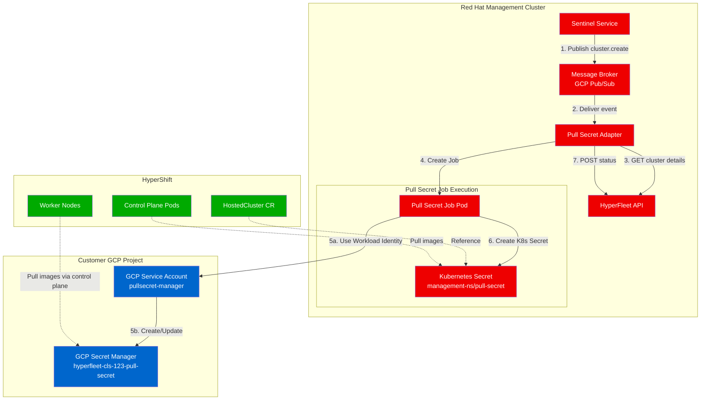
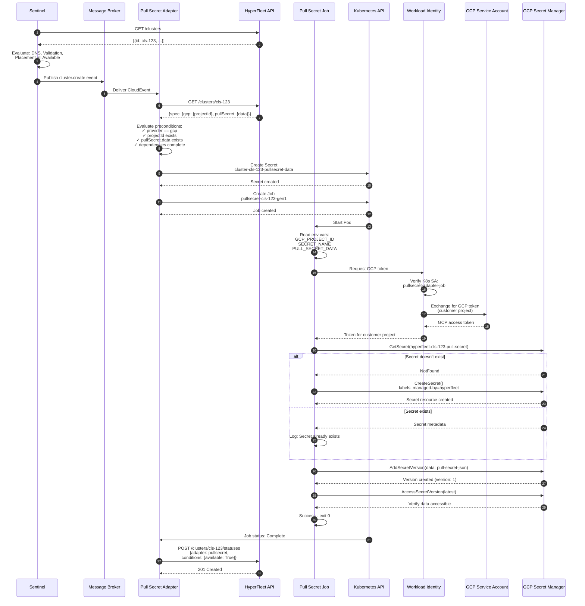
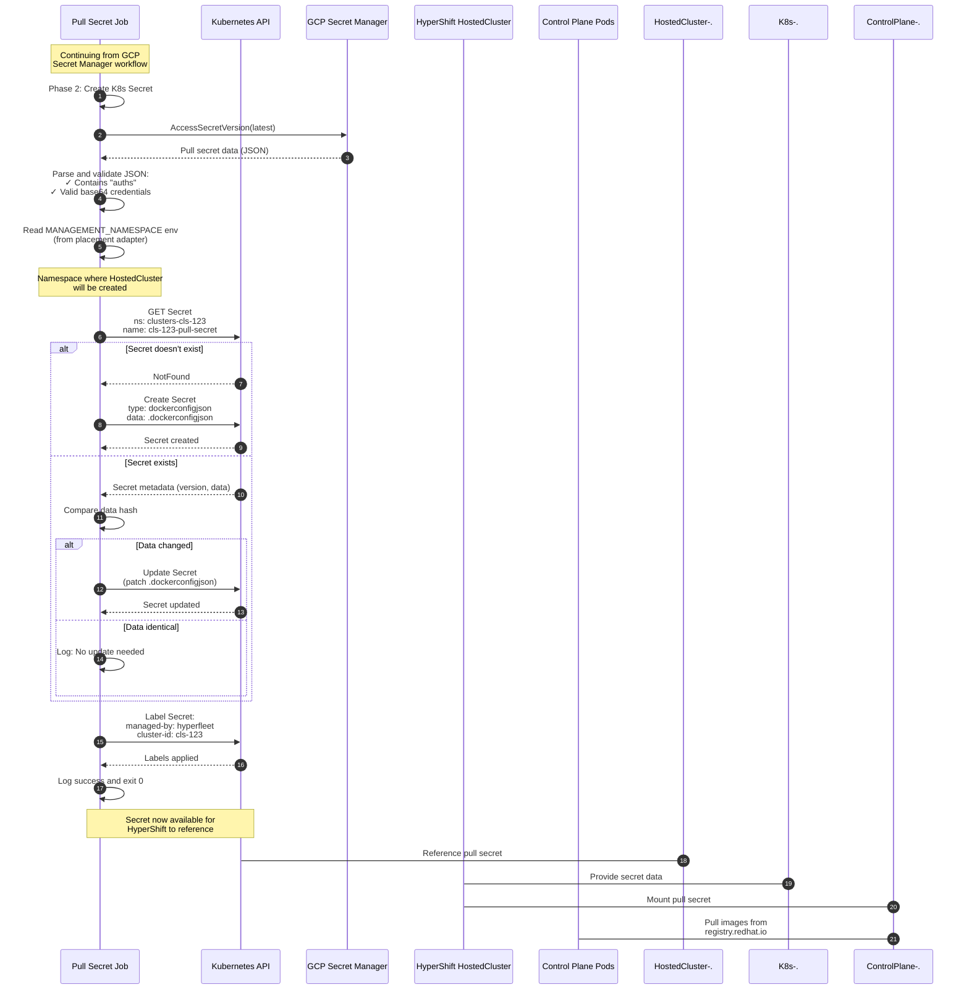
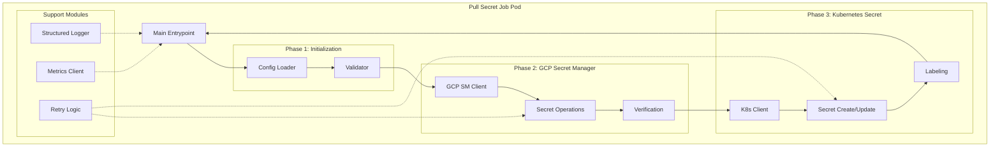

# Pull Secret Workflow and Implementation Plan

**Version:** 1.0.0
**Last Updated:** 2025-11-13
**Component:** Pull Secret Adapter - Complete Workflow Documentation

---

## Table of Contents

1. [Overview](#overview)
2. [High-Level Architecture](#high-level-architecture)
3. [Workflow 1: Store Secret in GCP Secret Manager](#workflow-1-store-secret-in-gcp-secret-manager)
4. [Workflow 2: Create/Update Kubernetes Secret in Management Cluster](#workflow-2-createupdate-kubernetes-secret-in-management-cluster)
5. [Pull Secret Job Architecture](#pull-secret-job-architecture)
6. [Implementation Details](#implementation-details)
7. [Error Handling and Edge Cases](#error-handling-and-edge-cases)
8. [Security Considerations](#security-considerations)
9. [Monitoring and Observability](#monitoring-and-observability)

---

## Overview

### Purpose

The Pull Secret Adapter manages image registry pull secrets for HyperShift-managed OpenShift clusters. It orchestrates two primary workflows:

1. **GCP Secret Manager Storage**: Store pull secrets securely in the customer's GCP Secret Manager
2. **Kubernetes Secret Provisioning**: Create pull secrets in the management cluster namespace for HyperShift to access

### Key Principles

- **Customer Data Sovereignty**: Pull secrets stored in customer's GCP project
- **Separation of Concerns**: Adapter orchestrates; Job executes
- **Event-Driven**: Triggered by CloudEvents from Sentinel
- **Idempotent**: Safe to retry on failure
- **Status-Driven**: Reports status to HyperFleet API for Sentinel decision-making

### Components Involved

| Component | Responsibility | Location |
|-----------|---------------|----------|
| **Sentinel** | Publishes cluster events | Red Hat management cluster |
| **Pull Secret Adapter** | Orchestrates secret provisioning | Red Hat management cluster |
| **Pull Secret Job** | Executes GCP API calls | Red Hat management cluster (runs as Job) |
| **GCP Secret Manager** | Stores pull secret data | Customer's GCP project |
| **Kubernetes Secret** | Provides pull secret to HyperShift | Management cluster namespace |
| **HyperFleet API** | Receives status updates | Red Hat management cluster |

---

## High-Level Architecture



### Architecture Flow Summary

1. **Event Trigger**: Sentinel publishes `cluster.create` event
2. **Adapter Receives**: Pull Secret Adapter consumes event from broker
3. **Precondition Check**: Adapter fetches cluster details and validates dependencies
4. **Job Creation**: Adapter creates Pull Secret Job with cluster context
5. **GCP Storage**: Job stores pull secret in customer's GCP Secret Manager
6. **K8s Secret Creation**: Job creates Kubernetes Secret in management cluster
7. **Status Report**: Adapter monitors Job and reports status to API

---

## Workflow 1: Store Secret in GCP Secret Manager

### Objective

Store the pull secret data in the customer's GCP Secret Manager for worker node access.

### Detailed Flow Diagram



### Workflow Steps

#### Phase 1: Event Reception and Validation (Steps 1-6)

1. **Sentinel Polling**: Sentinel polls HyperFleet API for clusters
2. **Decision Logic**: Evaluates that DNS, Validation, Placement adapters are complete
3. **Event Publishing**: Publishes `cluster.create` CloudEvent to broker
4. **Event Delivery**: Broker delivers event to Pull Secret Adapter subscription
5. **Cluster Fetch**: Adapter fetches full cluster details from API
6. **Precondition Evaluation**: Adapter checks:
   - `spec.provider == "gcp"`
   - `spec.gcp.projectId != nil`
   - `spec.pullSecret.data != nil`
   - `status.adapters[validation].available == "True"`
   - `status.adapters[dns].available == "True"`
   - `status.adapters[placement].available == "True"`

#### Phase 2: Resource Creation (Steps 7-9)

7. **K8s Secret Creation**: Adapter creates temporary Kubernetes Secret containing pull secret data
   - Name: `cluster-cls-123-pullsecret-data`
   - Namespace: `hyperfleet-system`
   - Data: Pull secret JSON from cluster spec

8. **Job Creation**: Adapter creates Kubernetes Job
   - Name: `pullsecret-cls-123-gen1` (includes generation ID)
   - Service Account: `pullsecret-adapter-job` (with Workload Identity)
   - Environment: `GCP_PROJECT_ID`, `SECRET_NAME`, `PULL_SECRET_DATA`

9. **Job Start**: Kubernetes schedules and starts Job pod

#### Phase 3: Workload Identity Authentication (Steps 10-15)

10. **Read Configuration**: Job reads environment variables
11. **Request Token**: Job requests GCP access token via Workload Identity
12. **Verify K8s SA**: Workload Identity verifies Kubernetes service account
13. **Exchange Token**: Exchanges K8s token for GCP access token
14. **GCP Token**: Receives access token for customer's GCP project
15. **Token Returned**: Job now has credentials to access customer's Secret Manager

#### Phase 4: GCP Secret Manager Operations (Steps 16-22)

16. **Check Secret Exists**: Job attempts to get secret metadata
17. **Create or Skip**:
    - **If NotFound**: Create new secret resource with labels
    - **If Exists**: Log that secret exists, continue
18. **Add Version**: Add new secret version with pull secret data
19. **Version Created**: GCP returns version number (e.g., `1`, `2`, etc.)
20. **Verify Access**: Job accesses latest version to verify it's readable
21. **Verification Success**: Confirms secret is properly stored
22. **Job Success**: Job exits with code 0

#### Phase 5: Status Reporting (Steps 23-25)

23. **Job Complete**: Kubernetes marks Job as Complete
24. **Status Post**: Adapter POSTs status to HyperFleet API
25. **Status Saved**: API persists status for Sentinel's next poll

### GCP Secret Manager Details

#### Secret Creation Parameters

```go
// CreateSecret request
CreateSecretRequest{
    Parent:   "projects/customer-prod-12345",
    SecretId: "hyperfleet-cls-123-pull-secret",
    Secret: &Secret{
        Replication: &Replication{
            Automatic: &Replication_Automatic{},
        },
        Labels: map[string]string{
            "managed-by":         "hyperfleet",
            "adapter":            "pullsecret",
            "cluster-id":         "cls-123",
            "cluster-name":       "production-cluster",
            "resource-type":      "pull-secret",
            "hyperfleet-version": "v1",
        },
    },
}
```

#### Secret Version Data

```go
// AddSecretVersion request
AddSecretVersionRequest{
    Parent: "projects/customer-prod-12345/secrets/hyperfleet-cls-123-pull-secret",
    Payload: &SecretPayload{
        Data: []byte(`{
            "auths": {
                "registry.redhat.io": {
                    "auth": "base64-encoded-credentials",
                    "email": "user@example.com"
                },
                "quay.io": {
                    "auth": "base64-encoded-credentials",
                    "email": "user@example.com"
                }
            }
        }`),
    },
}
```

### Output Artifacts

After successful completion:

**GCP Secret Manager**:
```
Resource Name: projects/customer-prod-12345/secrets/hyperfleet-cls-123-pull-secret
Version: 1 (or incremented)
State: ENABLED
Replication: Automatic
Labels: {managed-by=hyperfleet, cluster-id=cls-123, ...}
```

---

## Workflow 2: Create/Update Kubernetes Secret in Management Cluster

### Objective

Create a Kubernetes Secret in the management cluster namespace that HyperShift can reference for pulling container images.

### Detailed Flow Diagram



### Workflow Steps

#### Phase 1: Retrieve Secret from GCP (Steps 1-3)

1. **Start Phase 2**: Job transitions to Kubernetes secret creation
2. **Access Latest Version**: Retrieves pull secret data from GCP Secret Manager
3. **Validate Data**: Ensures JSON is valid Dockercfg format

#### Phase 2: Determine Target Namespace (Step 4)

4. **Read Namespace**: Job reads `MANAGEMENT_NAMESPACE` environment variable
   - This comes from Placement Adapter's decision
   - Format: `clusters-{cluster-id}` or regional namespace
   - Example: `clusters-cls-123` or `us-central1-clusters`

#### Phase 3: Create or Update Secret (Steps 5-12)

5. **Check Exists**: Attempt to get existing Kubernetes Secret
6. **Branch Decision**:
   - **Path A: Create New** (Steps 7-8)
     - Secret doesn't exist
     - Create new Secret with type `kubernetes.io/dockerconfigjson`
   - **Path B: Update Existing** (Steps 9-12)
     - Secret exists
     - Compare data hash
     - Update only if changed

#### Phase 4: Finalize (Steps 13-14)

13. **Apply Labels**: Add HyperFleet management labels
14. **Success**: Job completes successfully

### Kubernetes Secret Specification

#### Secret Resource

```yaml
apiVersion: v1
kind: Secret
metadata:
  name: cls-123-pull-secret
  namespace: clusters-cls-123  # From placement adapter
  labels:
    managed-by: hyperfleet
    adapter: pullsecret
    cluster-id: cls-123
    cluster-name: production-cluster
    hyperfleet-version: v1
  annotations:
    hyperfleet.io/gcp-secret-path: projects/customer-prod-12345/secrets/hyperfleet-cls-123-pull-secret/versions/latest
    hyperfleet.io/created-by: pullsecret-adapter
    hyperfleet.io/created-at: "2025-11-13T10:30:00Z"
type: kubernetes.io/dockerconfigjson
data:
  .dockerconfigjson: <base64-encoded-pull-secret-json>
```

#### Data Format

The `.dockerconfigjson` field contains base64-encoded Dockercfg JSON:

```json
{
  "auths": {
    "registry.redhat.io": {
      "auth": "dXNlcjpwYXNzd29yZA==",
      "email": "user@example.com"
    },
    "quay.io": {
      "auth": "dXNlcjpwYXNzd29yZA==",
      "email": "user@example.com"
    }
  }
}
```

### Namespace Selection Logic

The management namespace is determined by the **Placement Adapter**:

```go
// Placement Adapter provides this in cluster status
status.adapters.placement.data.managementCluster = "us-central1-mgmt-1"
status.adapters.placement.data.namespace = "clusters-cls-123"

// Job reads from environment (set by adapter)
MANAGEMENT_NAMESPACE = os.Getenv("MANAGEMENT_NAMESPACE") // "clusters-cls-123"
```

### Update Detection

Job uses hash comparison to avoid unnecessary updates:

```go
// Calculate current hash
currentHash := sha256.Sum256(currentSecretData)

// Calculate new hash
newHash := sha256.Sum256(pullSecretDataFromGCP)

if currentHash != newHash {
    // Update required
    updateSecret(newData)
} else {
    log.Info("Secret data unchanged, skipping update")
}
```

### Output Artifacts

After successful completion:

**Kubernetes Secret**:
```
Namespace: clusters-cls-123
Name: cls-123-pull-secret
Type: kubernetes.io/dockerconfigjson
Data: .dockerconfigjson (pull secret JSON)
Labels: {managed-by=hyperfleet, cluster-id=cls-123, ...}
```

---

## Pull Secret Job Architecture

### High-Level Design



### Job Components

#### 1. Main Entrypoint (`main.go`)

**Responsibilities**:
- Parse command-line flags and environment variables
- Initialize clients (GCP, Kubernetes, logging)
- Orchestrate workflow phases
- Handle panic recovery
- Exit with appropriate code

**Implementation**:
```go
package main

import (
    "context"
    "log"
    "os"

    secretmanager "cloud.google.com/go/secretmanager/apiv1"
    "k8s.io/client-go/kubernetes"
)

func main() {
    ctx := context.Background()

    // Phase 1: Load configuration
    config, err := loadConfig()
    if err != nil {
        log.Fatalf("Failed to load config: %v", err)
    }

    // Validate configuration
    if err := validateConfig(config); err != nil {
        log.Fatalf("Invalid config: %v", err)
    }

    // Initialize clients
    gcpClient, err := secretmanager.NewClient(ctx)
    if err != nil {
        log.Fatalf("Failed to create GCP client: %v", err)
    }
    defer gcpClient.Close()

    k8sClient, err := kubernetes.NewForConfig(getK8sConfig())
    if err != nil {
        log.Fatalf("Failed to create K8s client: %v", err)
    }

    // Phase 2: Store in GCP Secret Manager
    log.Printf("Phase 1: Storing secret in GCP Secret Manager")
    if err := storeInGCP(ctx, gcpClient, config); err != nil {
        log.Fatalf("Failed to store in GCP: %v", err)
    }

    // Phase 3: Create Kubernetes Secret
    log.Printf("Phase 2: Creating Kubernetes Secret")
    if err := createK8sSecret(ctx, k8sClient, config); err != nil {
        log.Fatalf("Failed to create K8s secret: %v", err)
    }

    log.Printf("Success: Pull secret provisioned")
    os.Exit(0)
}
```

#### 2. Configuration Module (`config/config.go`)

**Responsibilities**:
- Load environment variables
- Parse and validate inputs
- Provide configuration struct

**Configuration Structure**:
```go
type Config struct {
    // Cluster information
    ClusterID   string
    ClusterName string

    // GCP configuration
    GCPProjectID      string
    SecretName        string
    ReplicationPolicy string

    // Secret data
    PullSecretData string // JSON string

    // Kubernetes configuration
    ManagementNamespace string
    K8sSecretName       string

    // Logging
    LogLevel  string
    LogFormat string // json or text
}

func loadConfig() (*Config, error) {
    config := &Config{
        ClusterID:           getEnvRequired("CLUSTER_ID"),
        ClusterName:         getEnvRequired("CLUSTER_NAME"),
        GCPProjectID:        getEnvRequired("GCP_PROJECT_ID"),
        SecretName:          getEnvWithDefault("SECRET_NAME", ""),
        ReplicationPolicy:   getEnvWithDefault("REPLICATION_POLICY", "automatic"),
        PullSecretData:      getEnvRequired("PULL_SECRET_DATA"),
        ManagementNamespace: getEnvRequired("MANAGEMENT_NAMESPACE"),
        K8sSecretName:       getEnvWithDefault("K8S_SECRET_NAME", ""),
        LogLevel:            getEnvWithDefault("LOG_LEVEL", "info"),
        LogFormat:           getEnvWithDefault("LOG_FORMAT", "json"),
    }

    // Auto-derive secret names if not provided
    if config.SecretName == "" {
        config.SecretName = fmt.Sprintf("hyperfleet-%s-pull-secret", config.ClusterID)
    }

    if config.K8sSecretName == "" {
        config.K8sSecretName = fmt.Sprintf("%s-pull-secret", config.ClusterID)
    }

    return config, nil
}
```

#### 3. GCP Secret Manager Module (`gcp/secretmanager.go`)

**Responsibilities**:
- Create or update GCP secrets
- Verify secret accessibility
- Handle GCP API errors

**Key Functions**:
```go
func storeInGCP(ctx context.Context, client *secretmanager.Client, config *Config) error {
    // 1. Check if secret exists
    exists, err := secretExists(ctx, client, config.GCPProjectID, config.SecretName)
    if err != nil {
        return fmt.Errorf("failed to check secret: %w", err)
    }

    // 2. Create secret if needed
    if !exists {
        if err := createSecret(ctx, client, config); err != nil {
            return fmt.Errorf("failed to create secret: %w", err)
        }
    }

    // 3. Add secret version
    version, err := addSecretVersion(ctx, client, config)
    if err != nil {
        return fmt.Errorf("failed to add version: %w", err)
    }

    log.Printf("Created secret version: %s", version.Name)

    // 4. Verify accessibility
    if err := verifySecret(ctx, client, config); err != nil {
        return fmt.Errorf("failed to verify secret: %w", err)
    }

    return nil
}

func createSecret(ctx context.Context, client *secretmanager.Client, config *Config) error {
    req := &secretmanagerpb.CreateSecretRequest{
        Parent:   fmt.Sprintf("projects/%s", config.GCPProjectID),
        SecretId: config.SecretName,
        Secret: &secretmanagerpb.Secret{
            Replication: getReplicationPolicy(config.ReplicationPolicy),
            Labels: map[string]string{
                "managed-by":         "hyperfleet",
                "adapter":            "pullsecret",
                "cluster-id":         config.ClusterID,
                "cluster-name":       config.ClusterName,
                "resource-type":      "pull-secret",
                "hyperfleet-version": "v1",
            },
        },
    }

    _, err := client.CreateSecret(ctx, req)
    return err
}
```

#### 4. Kubernetes Secret Module (`k8s/secret.go`)

**Responsibilities**:
- Create or update Kubernetes secrets
- Apply labels and annotations
- Handle Kubernetes API errors

**Key Functions**:
```go
func createK8sSecret(ctx context.Context, client kubernetes.Interface, config *Config) error {
    // 1. Parse pull secret JSON
    pullSecretJSON := config.PullSecretData

    // 2. Validate format
    if err := validatePullSecretFormat(pullSecretJSON); err != nil {
        return fmt.Errorf("invalid pull secret format: %w", err)
    }

    // 3. Check if secret exists
    secretClient := client.CoreV1().Secrets(config.ManagementNamespace)
    existing, err := secretClient.Get(ctx, config.K8sSecretName, metav1.GetOptions{})

    if err != nil {
        if errors.IsNotFound(err) {
            // Create new secret
            return createNewSecret(ctx, secretClient, config, pullSecretJSON)
        }
        return fmt.Errorf("failed to get secret: %w", err)
    }

    // Update existing secret if needed
    return updateSecretIfChanged(ctx, secretClient, existing, config, pullSecretJSON)
}

func createNewSecret(ctx context.Context, client v1.SecretInterface, config *Config, data string) error {
    secret := &corev1.Secret{
        ObjectMeta: metav1.ObjectMeta{
            Name:      config.K8sSecretName,
            Namespace: config.ManagementNamespace,
            Labels: map[string]string{
                "managed-by":         "hyperfleet",
                "adapter":            "pullsecret",
                "cluster-id":         config.ClusterID,
                "cluster-name":       config.ClusterName,
                "hyperfleet-version": "v1",
            },
            Annotations: map[string]string{
                "hyperfleet.io/gcp-secret-path": fmt.Sprintf(
                    "projects/%s/secrets/%s/versions/latest",
                    config.GCPProjectID,
                    config.SecretName,
                ),
                "hyperfleet.io/created-by": "pullsecret-adapter",
                "hyperfleet.io/created-at": time.Now().Format(time.RFC3339),
            },
        },
        Type: corev1.SecretTypeDockerConfigJson,
        Data: map[string][]byte{
            corev1.DockerConfigJsonKey: []byte(data),
        },
    }

    _, err := client.Create(ctx, secret, metav1.CreateOptions{})
    return err
}
```

#### 5. Validation Module (`validation/validator.go`)

**Responsibilities**:
- Validate pull secret JSON format
- Validate configuration parameters
- Check GCP project ID format

**Key Functions**:
```go
func validatePullSecretFormat(pullSecretJSON string) error {
    var pullSecret map[string]interface{}

    // 1. Valid JSON
    if err := json.Unmarshal([]byte(pullSecretJSON), &pullSecret); err != nil {
        return fmt.Errorf("invalid JSON: %w", err)
    }

    // 2. Contains "auths"
    auths, ok := pullSecret["auths"]
    if !ok {
        return fmt.Errorf("missing 'auths' key")
    }

    // 3. Auths is a map
    authsMap, ok := auths.(map[string]interface{})
    if !ok || len(authsMap) == 0 {
        return fmt.Errorf("'auths' must be a non-empty object")
    }

    // 4. Each registry has 'auth' field
    for registry, entry := range authsMap {
        entryMap, ok := entry.(map[string]interface{})
        if !ok {
            return fmt.Errorf("registry '%s' entry must be an object", registry)
        }

        if _, hasAuth := entryMap["auth"]; !hasAuth {
            return fmt.Errorf("registry '%s' missing 'auth' field", registry)
        }
    }

    return nil
}

func validateConfig(config *Config) error {
    // Validate cluster ID
    if !validClusterID(config.ClusterID) {
        return fmt.Errorf("invalid cluster ID format")
    }

    // Validate GCP project ID
    if !validGCPProjectID(config.GCPProjectID) {
        return fmt.Errorf("invalid GCP project ID")
    }

    // Validate secret name format
    if !validSecretName(config.SecretName) {
        return fmt.Errorf("invalid secret name")
    }

    return nil
}
```

#### 6. Retry Logic Module (`retry/retry.go`)

**Responsibilities**:
- Implement exponential backoff
- Retry transient failures
- Respect context deadlines

**Implementation**:
```go
func WithRetry(ctx context.Context, maxRetries int, fn func() error) error {
    var err error

    for attempt := 0; attempt < maxRetries; attempt++ {
        err = fn()
        if err == nil {
            return nil
        }

        // Check if retryable
        if !isRetryable(err) {
            return err
        }

        // Calculate backoff
        backoff := time.Duration(1<<uint(attempt)) * time.Second
        if backoff > 30*time.Second {
            backoff = 30 * time.Second
        }

        log.Printf("Retry %d/%d after %s: %v", attempt+1, maxRetries, backoff, err)

        // Wait with context cancellation support
        select {
        case <-ctx.Done():
            return ctx.Err()
        case <-time.After(backoff):
        }
    }

    return fmt.Errorf("max retries exceeded: %w", err)
}

func isRetryable(err error) bool {
    // GCP errors
    if status.Code(err) == codes.Unavailable ||
       status.Code(err) == codes.DeadlineExceeded ||
       status.Code(err) == codes.Internal {
        return true
    }

    // Kubernetes errors
    if errors.IsServerTimeout(err) ||
       errors.IsTimeout(err) ||
       errors.IsServiceUnavailable(err) {
        return true
    }

    return false
}
```

### Job Container Specification

#### Dockerfile

```dockerfile
FROM golang:1.21 AS builder

WORKDIR /app

# Copy go mod files
COPY go.mod go.sum ./
RUN go mod download

# Copy source code
COPY . .

# Build binary
RUN CGO_ENABLED=0 GOOS=linux go build \
    -a -installsuffix cgo \
    -o pullsecret-job \
    ./cmd/pullsecret-job

# Final image
FROM registry.access.redhat.com/ubi8/ubi-minimal:latest

# Non-root user
RUN microdnf install -y shadow-utils && \
    useradd -u 1000 -m jobuser && \
    microdnf remove shadow-utils && \
    microdnf clean all

# Copy binary
COPY --from=builder /app/pullsecret-job /usr/local/bin/pullsecret-job

# Set user
USER 1000

ENTRYPOINT ["/usr/local/bin/pullsecret-job"]
```

#### Resource Requirements

```yaml
resources:
  requests:
    cpu: 100m
    memory: 128Mi
  limits:
    cpu: 500m
    memory: 512Mi
```

#### Security Context

```yaml
securityContext:
  allowPrivilegeEscalation: false
  runAsNonRoot: true
  runAsUser: 1000
  capabilities:
    drop:
    - ALL
  readOnlyRootFilesystem: true
```

---

## Implementation Details

### Environment Variables

The Job receives configuration via environment variables:

| Variable | Source | Example | Required |
|----------|--------|---------|----------|
| `CLUSTER_ID` | Adapter | `cls-abc123` | Yes |
| `CLUSTER_NAME` | Adapter | `production-cluster` | Yes |
| `GCP_PROJECT_ID` | Cluster spec | `customer-prod-12345` | Yes |
| `SECRET_NAME` | Auto-derived | `hyperfleet-cls-abc123-pull-secret` | No |
| `PULL_SECRET_DATA` | Kubernetes Secret | `{"auths": {...}}` | Yes |
| `MANAGEMENT_NAMESPACE` | Placement adapter | `clusters-cls-abc123` | Yes |
| `REPLICATION_POLICY` | Cluster spec | `automatic` | No |
| `LOG_LEVEL` | Adapter config | `info` | No |
| `LOG_FORMAT` | Adapter config | `json` | No |
| `GCP_API_TIMEOUT` | Adapter config | `30s` | No |

### Workload Identity Configuration

#### Kubernetes Service Account

```yaml
apiVersion: v1
kind: ServiceAccount
metadata:
  name: pullsecret-adapter-job
  namespace: hyperfleet-system
  annotations:
    iam.gke.io/gcp-service-account: pullsecret-manager@customer-prod-12345.iam.gserviceaccount.com
```

#### GCP IAM Binding

```bash
# Allow K8s SA to impersonate GCP SA
gcloud iam service-accounts add-iam-policy-binding \
    pullsecret-manager@customer-prod-12345.iam.gserviceaccount.com \
    --member="serviceAccount:redhat-mgmt-project.svc.id.goog[hyperfleet-system/pullsecret-adapter-job]" \
    --role="roles/iam.workloadIdentityUser" \
    --project=customer-prod-12345
```

### Logging Structure

Jobs use structured JSON logging:

```json
{
  "timestamp": "2025-11-13T10:30:45Z",
  "level": "info",
  "component": "pullsecret-job",
  "cluster_id": "cls-abc123",
  "gcp_project": "customer-prod-12345",
  "phase": "gcp-secret-manager",
  "operation": "create-secret-version",
  "message": "Created secret version",
  "secret_name": "hyperfleet-cls-abc123-pull-secret",
  "version": "1",
  "duration_ms": 245
}
```

### Metrics Collection

Jobs emit metrics for observability:

```go
// Metrics emitted
pullsecret_job_duration_seconds{cluster_id, result}
pullsecret_gcp_api_calls_total{operation, status_code}
pullsecret_k8s_api_calls_total{operation, status_code}
pullsecret_secret_versions_created_total{cluster_id}
```

---

## Error Handling and Edge Cases

### Error Scenarios

#### 1. GCP Authentication Failure

**Symptom**: Workload Identity token exchange fails

**Causes**:
- GCP service account doesn't exist
- IAM binding not configured
- Workload Identity not enabled

**Handling**:
```go
if status.Code(err) == codes.PermissionDenied {
    log.Error("Workload Identity authentication failed")
    log.Error("Verify GCP service account and IAM bindings")
    return fmt.Errorf("authentication failed: %w", err)
}
```

**Resolution**:
- Customer must configure Workload Identity binding
- Adapter should report clear error in status
- Provide setup documentation link

#### 2. Secret Manager Quota Exceeded

**Symptom**: `ResourceExhausted` error from GCP

**Causes**:
- Too many API requests
- Project quota limits reached

**Handling**:
```go
if status.Code(err) == codes.ResourceExhausted {
    log.Error("GCP Secret Manager quota exceeded")
    // Implement exponential backoff
    return WithRetry(ctx, 5, func() error {
        return addSecretVersion(ctx, client, config)
    })
}
```

**Resolution**:
- Retry with exponential backoff
- Contact customer to increase quotas
- Rate limit adapter operations

#### 3. Invalid Pull Secret Format

**Symptom**: Validation fails on pull secret JSON

**Causes**:
- Malformed JSON
- Missing required fields
- Invalid base64 encoding

**Handling**:
```go
if err := validatePullSecretFormat(pullSecretData); err != nil {
    log.Error("Invalid pull secret format", "error", err)
    // This is a permanent error - don't retry
    return fmt.Errorf("invalid pull secret: %w", err)
}
```

**Resolution**:
- Report validation error to API
- User must fix pull secret data in cluster spec
- Provide clear error message about what's wrong

#### 4. Kubernetes Namespace Doesn't Exist

**Symptom**: Namespace not found when creating secret

**Causes**:
- Placement adapter hasn't created namespace yet
- Namespace deleted

**Handling**:
```go
if errors.IsNotFound(err) && isNamespaceError(err) {
    log.Error("Management namespace not found", "namespace", config.ManagementNamespace)
    // This might be a timing issue - retry
    return fmt.Errorf("namespace not found (may need to wait for placement): %w", err)
}
```

**Resolution**:
- Adapter should verify placement completed first (precondition)
- Retry with backoff in case of timing issue
- If persistent, report dependency failure

#### 5. GCP Secret Already Exists (Different Owner)

**Symptom**: Secret exists but lacks HyperFleet labels

**Causes**:
- Secret created manually
- Secret from previous HyperFleet version
- Naming conflict

**Handling**:
```go
existingSecret, err := client.GetSecret(ctx, req)
if err == nil {
    // Check if managed by HyperFleet
    if existingSecret.Labels["managed-by"] != "hyperfleet" {
        log.Warn("Secret exists but not managed by HyperFleet")
        // Option 1: Fail and require manual intervention
        return fmt.Errorf("secret exists but not managed by HyperFleet")

        // Option 2: Adopt the secret (risky)
        // updateSecretLabels(ctx, client, existingSecret)
    }
}
```

**Resolution**:
- Fail and require customer to rename or delete conflicting secret
- Provide clear error message about conflict
- Document naming conventions

### Edge Cases

#### Secret Update During Job Execution

**Scenario**: Pull secret updated in API while Job is running

**Impact**: Job may create outdated secret version

**Mitigation**:
- Job uses generation ID in name: `pullsecret-cls-123-gen1`
- Sentinel will trigger new event for generation 2
- Idempotent: Adding same data creates new version (safe)

#### Multiple Jobs Running Concurrently

**Scenario**: Multiple Jobs for same cluster run simultaneously

**Impact**: Race condition on secret creation

**Mitigation**:
```go
// GCP Secret Manager handles concurrent CreateSecret atomically
_, err := client.CreateSecret(ctx, req)
if status.Code(err) == codes.AlreadyExists {
    log.Info("Secret already created by another job")
    // Continue to add version (this is fine)
}
```

#### Kubernetes Secret Deleted Externally

**Scenario**: K8s secret deleted after Job completes

**Impact**: HyperShift loses pull secret access

**Mitigation**:
- Sentinel detects missing secret on next poll
- Triggers new event to recreate
- Adapter should have drift detection (post-MVP)

#### GCP Service Account Key Rotation

**Scenario**: Customer rotates service account keys

**Impact**: Workload Identity uses service account identity, not keys

**Mitigation**:
- No impact - Workload Identity doesn't use keys
- Token exchange happens transparently
- Document that key rotation is not needed

---

## Security Considerations

### Secrets in Transit

**Concern**: Pull secret exposed during transfer

**Mitigations**:
1. **Environment Variables**: Kubernetes injects from Secret (not visible in logs)
2. **TLS**: All API calls use HTTPS/TLS
3. **No Logging**: Never log pull secret data
4. **Memory Only**: Secret data never written to disk

### Secrets at Rest

**GCP Secret Manager**:
- Encrypted at rest by default
- Customer-managed encryption keys (CMEK) supported
- Access logged in Cloud Audit Logs

**Kubernetes Secret**:
- Stored in etcd
- etcd encryption at rest recommended
- RBAC controls access

### Access Control

**GCP Secret Manager**:
- Only customer's service account has access
- Least-privilege IAM: `secretmanager.secretAccessor` for workers
- HyperFleet Job: `secretmanager.admin` (create/update only)

**Kubernetes Secret**:
- Namespace isolation
- RBAC: Only HyperShift operator can read
- ServiceAccount token rotation enabled

### Audit Logging

**GCP Cloud Audit Logs**:
```json
{
  "protoPayload": {
    "methodName": "google.cloud.secretmanager.v1.SecretManagerService.AddSecretVersion",
    "resourceName": "projects/customer-prod-12345/secrets/hyperfleet-cls-123-pull-secret",
    "authenticationInfo": {
      "principalEmail": "pullsecret-manager@customer-prod-12345.iam.gserviceaccount.com"
    }
  }
}
```

**Kubernetes Audit Logs**:
```json
{
  "verb": "create",
  "objectRef": {
    "resource": "secrets",
    "namespace": "clusters-cls-123",
    "name": "cls-123-pull-secret"
  },
  "user": {
    "username": "system:serviceaccount:hyperfleet-system:pullsecret-adapter-job"
  }
}
```

### Compliance

**Data Residency**:
- Secrets stored in customer's GCP project
- Respects customer's project region settings
- Replication policy controlled by customer

**Access Tracking**:
- All secret access logged
- Customer has full audit trail
- Retention policies configurable

---

## Monitoring and Observability

### Metrics

**Job-Level Metrics**:
```promql
# Job execution duration
pullsecret_job_duration_seconds{cluster_id="cls-123", result="success"}

# GCP API call latency
pullsecret_gcp_api_duration_seconds{operation="add_secret_version"}

# Kubernetes API call latency
pullsecret_k8s_api_duration_seconds{operation="create_secret"}

# Success rate
rate(pullsecret_job_total{result="success"}[5m]) /
rate(pullsecret_job_total[5m])
```

**Adapter-Level Metrics**:
```promql
# Events processed
pullsecret_adapter_events_processed_total{result="success"}

# Jobs created
pullsecret_adapter_jobs_created_total{cluster_id}

# Status updates sent
pullsecret_adapter_status_updates_total{result="success"}
```

### Alerting Rules

```yaml
groups:
- name: pullsecret
  rules:
  # Job failure rate > 10%
  - alert: PullSecretJobHighFailureRate
    expr: |
      rate(pullsecret_job_total{result="failure"}[10m]) /
      rate(pullsecret_job_total[10m]) > 0.1
    for: 5m
    annotations:
      summary: "High failure rate for Pull Secret Jobs"

  # GCP API errors
  - alert: PullSecretGCPAPIErrors
    expr: |
      rate(pullsecret_gcp_api_calls_total{status_code=~"5.."}[5m]) > 0
    for: 5m
    annotations:
      summary: "GCP Secret Manager API errors"

  # Job duration > 5 minutes
  - alert: PullSecretJobSlow
    expr: |
      pullsecret_job_duration_seconds > 300
    annotations:
      summary: "Pull Secret Job taking too long"
```

### Logging

**Structured Logs**:
```json
{
  "timestamp": "2025-11-13T10:30:45Z",
  "level": "info",
  "cluster_id": "cls-abc123",
  "gcp_project": "customer-prod-12345",
  "phase": "k8s-secret",
  "operation": "create-secret",
  "namespace": "clusters-cls-abc123",
  "secret_name": "cls-abc123-pull-secret",
  "message": "Created Kubernetes secret",
  "duration_ms": 145
}
```

**Log Levels**:
- `debug`: Detailed operation logs
- `info`: Normal operation progress
- `warn`: Retryable errors, deprecated features
- `error`: Permanent failures, critical issues

### Dashboards

**Pull Secret Overview**:
- Total jobs executed (success/failure)
- Average job duration
- GCP API call rate
- Kubernetes secret creation rate

**Error Tracking**:
- Top error types
- Failure rate by cluster
- Retry attempts histogram

**Performance**:
- Job execution time percentiles (p50, p95, p99)
- GCP API latency
- Kubernetes API latency

---

## Appendix: Complete Workflow Summary

### End-to-End Timeline

```
T+0s:   Sentinel polls API, detects cluster ready for pull secret
T+1s:   Sentinel publishes cluster.create event to broker
T+2s:   Adapter receives event, fetches cluster details
T+3s:   Adapter evaluates preconditions (all pass)
T+4s:   Adapter creates Kubernetes Secret (pull-secret-data)
T+5s:   Adapter creates Job (pullsecret-cls-123-gen1)
T+6s:   Kubernetes schedules Job pod
T+8s:   Job starts, loads configuration
T+10s:  Job requests Workload Identity token
T+12s:  Job receives GCP access token
T+15s:  Job creates secret in GCP Secret Manager
T+18s:  Job adds secret version with pull secret data
T+20s:  Job verifies secret accessibility
T+22s:  Job creates Kubernetes Secret in management namespace
T+25s:  Job completes successfully (exit 0)
T+26s:  Adapter detects Job completion
T+27s:  Adapter POSTs status to API (available=True)
T+28s:  API saves status
T+30s:  Sentinel polls API on next cycle
T+31s:  Sentinel sees pull secret available
T+32s:  Sentinel triggers HyperShift adapter (next step)
```

**Total Duration**: ~30 seconds for happy path

---

## Document Revision History

| Version | Date | Author | Changes |
|---------|------|--------|---------|
| 1.0.0 | 2025-11-13 | HyperFleet Team | Initial release |

---

**Maintained By**: HyperFleet Platform Team
**Related Components**: Pull Secret Adapter, GCP Secret Manager, HyperShift
**Related Documentation**:
- [Pull Secret Requirements](./pull-secret-requirements.md)
- [Adapter Configuration](./pullsecret-adapter-config.yaml)
- [GCP SDK Methods](./gcp-secret-manager-sdk-methods.md)
